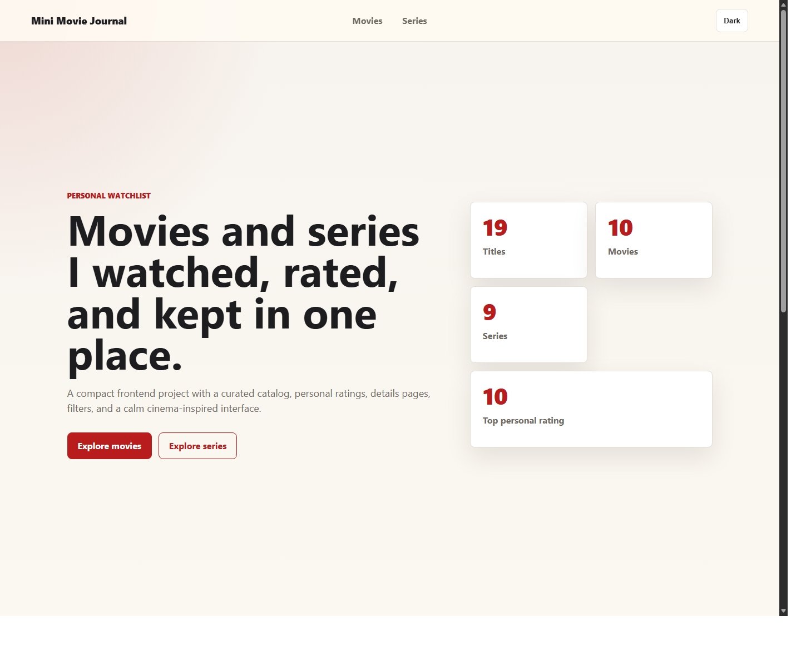
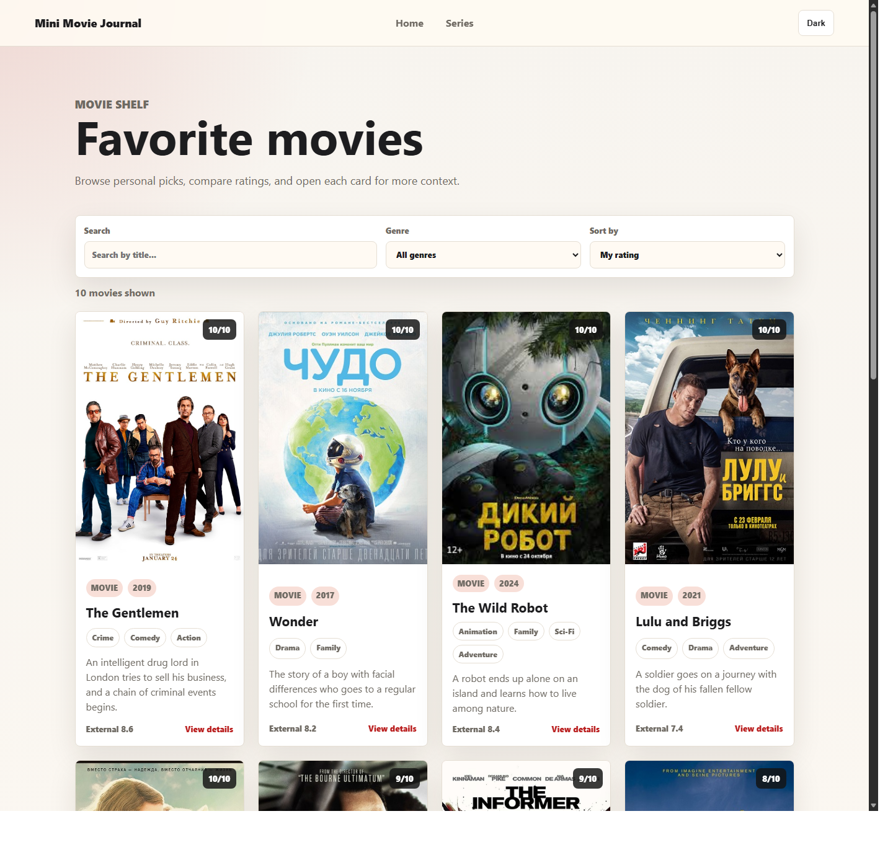
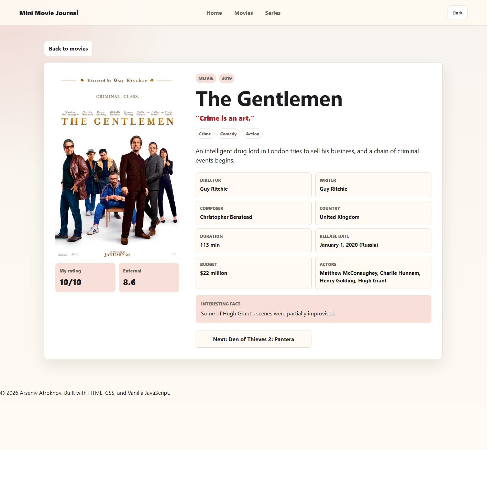

# Mini Movie Journal

Mini Movie Journal is a small personal catalog of movies and TV series I have watched. The project focuses on a clean frontend experience: curated cards, personal ratings, genre filters, sorting, details pages, and a saved light/dark theme.

It started as a simple learning project and was improved into a more polished Vanilla JavaScript app without adding a heavy framework.

## Live Demo

[Open the site on GitHub Pages](https://condrusarsen.github.io/mini-kinopoisk/)

## Screenshots

### Home



### Movies



### Details



## Features

- Personal collection of movies and TV series
- Separate pages for movies and series
- Search by title
- Genre filter
- Sorting by personal rating, external rating, year, and title
- Responsive movie cards with posters, tags, ratings, and hover states
- Details page with cast, director, country, duration, facts, and previous / next navigation
- Light and dark theme with saved user preference
- Empty states for missing search results or incorrect detail links
- Mobile-friendly layout

## Technologies

- HTML5
- CSS3
- Vanilla JavaScript
- CSS Grid and Flexbox
- LocalStorage
- Git and GitHub Pages

## Project Structure

```text
project/
|-- assets/
|   |-- img/
|   |   `-- *.jpg
|   `-- screenshots/
|       |-- details.png
|       |-- home.png
|       `-- movies.png
|-- data/
|   `-- movies.js
|-- scripts/
|   |-- details.js
|   `-- main.js
|-- styles/
|   `-- main.css
|-- details.html
|-- films.html
|-- index.html
`-- series.html
```

## How to Run Locally

This is a static project, so it does not require installing dependencies.

Open `index.html` directly in a browser, or run a small local server:

```bash
python -m http.server 4173
```

Then open:

```text
http://localhost:4173
```

## What I Practiced

- Building a multi-page website
- Rendering UI from JavaScript data
- Working with URL query parameters
- Creating reusable UI behavior without a framework
- Designing responsive cards and details layouts
- Saving theme preference with LocalStorage
- Improving accessibility with real links, labels, and focus states

## Future Improvements

- Add a favorites or "watch again" marker
- Add more titles and richer personal notes
- Add poster image optimization
- Add screenshots to the README
- Add small automated checks for broken data and missing images

## Author

**Arseniy Atrokhov**

An independent frontend learning project improved with assistant-guided iteration.
